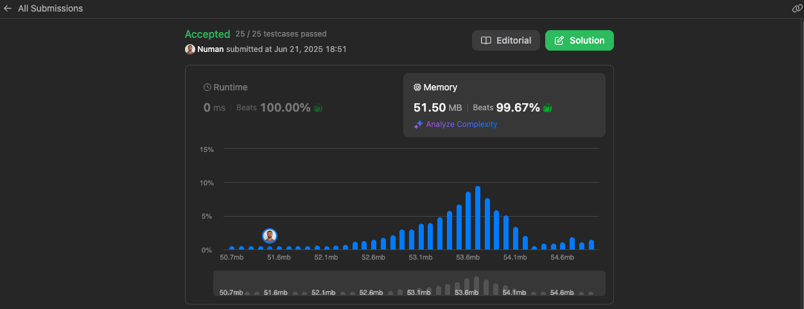

# Letter Combinations of a Phone Number

This project provides a simple and effective solution to generate all possible letter combinations that a phone number could represent using the digits-to-letters mapping of a classic phone keypad.

[LeetCode Question](https://leetcode.com/problems/letter-combinations-of-a-phone-number/ "@embed")

[My Solution](https://leetcode.com/problems/letter-combinations-of-a-phone-number/solutions/6869488/a-simple-solution-compatible-with-the-ja-jndr "@embed")

---

## 📌 Intuition

A simple solution compatible with the JavaScript `Array.prototype.reduce()` method to iteratively generate all possible combinations of letters for the given input digits.

---

## ⚙️ Approach

1. **Check if input is empty**  
   If the `digits` string is empty, return an empty array immediately — there are no combinations to generate.

2. **Convert the input string into an array of numbers**  
   Example:  
   `"23"` → `[2, 3]`

3. **Map each digit to its corresponding letters using the `digitConfig` object**  
   Example mapping:

    - 2 → ['a', 'b', 'c']
    - 3 → ['d', 'e', 'f']

    - Resulting in: [['a', 'b', 'c'], ['d', 'e', 'f']]


4. **Check if the mapping array is empty**  
If there are no valid digits, return an empty array.

5. **Use the `reduce` function to combine the arrays step by step**  
- Start with an empty accumulator.
- For each group of letters, build new combinations with previously accumulated prefixes.
- Two nested loops are used to generate all possible combinations between the current group and previous results.

6. **Return the final result**  
The resulting array contains all valid combinations of letters for the input digit string.

---

## 🔣 Pseudocode
```javascript Pseudo
FUNCTION letterCombinations(digits):
 IF digits is empty:
     RETURN empty array

 digitToLettersMap = {
     2: ['a','b','c'],
     3: ['d','e','f'],
     4: ['g','h','i'],
     5: ['j','k','l'],
     6: ['m','n','o'],
     7: ['p','q','r','s'],
     8: ['t','u','v'],
     9: ['w','x','y','z']
 }

 letterGroups = []
 FOR each digit IN digits:
     number = convert digit to number
     letterGroups.ADD(digitToLettersMap[number])

 IF letterGroups is empty:
     RETURN empty array

 combinations = letterGroups.REDUCE(initial = [], (accumulator, currentGroup) => 
     IF accumulator is empty:
         RETURN currentGroup

     temp = []
     FOR each prefix IN accumulator:
         FOR each letter IN currentGroup:
             temp.ADD(prefix + letter)

     RETURN temp
 )

 RETURN combinations
```
```javascript Code
/**
 * @param {string} digits
 * @return {string[]}
 */
var letterCombinations = function (digits) {
    if (!digits) return [];

    const splitted = digits.split('');

    const digitConfig = {
        2: ['a', 'b', 'c'],
        3: ['d', 'e', 'f'],
        4: ['g', 'h', 'i'],
        5: ['j', 'k', 'l'],
        6: ['m', 'n', 'o'],
        7: ['p', 'q', 'r', 's'],
        8: ['t', 'u', 'v'],
        9: ['w', 'x', 'y', 'z']
    }
    const output = [];
    splitted.map(item => output.push(digitConfig[item]));

    return output.reduce((a, c) => {
        if (a.length === 0) return c;

        const tempArray = [];
        for (let i = 0; i < a.length; i++) {
            for (let j = 0; j < c.length; j++) {
                tempArray.push(a[i] + c[j]);
            }
        }

        return tempArray;
    }, []);
};
```

----------

| Complexity Type | Value                                                                                                  |
|:---------------:|:------------------------------------------------------------------------------------------------------:|
| **Time**        | `O(3ⁿ)` to `O(4ⁿ)` depending on the digits used (e.g., `7` and `9` map to 4 letters, others map to 3). |
| **Space**       | `O(3ⁿ)` to `O(4ⁿ)` due to storing all generated letter combinations.                                   |

Results: 